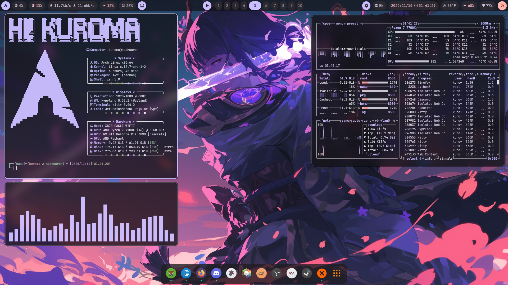

# My Archlinux Configs

This repository contains my Arch Linux Hyprland rice configuration as well as scripts to transform an arch system to a copy of mine.

**Disclaimer** the package list currently assumes NVIDIA cards, since I've only been installing my setup on NVIDIA machines.



## Demo

### Rice showcase

| Terminals | Cheat sheet |
|------------------|--------------|
|  |  |
| **Visual Studio Code** | **Browser (Firefox)** |
|  |  |
| **Dolphin (QT)** | **GIMP (GTK)** |
|  |  |

### Theme swapping + Animated wallpaper

https://github.com/user-attachments/assets/6e62c5ae-b80c-4d13-82e5-a0f5d0adbfe2

## Features
**Press Super+K to access the dynamically generated cheat sheet!**
- Functional top bar (waybar) with the following components
    - system monitor
    - media control
    - workspaces
    - audio/wifi/bluetooth/power
    - other fun stuff inside of "quick actions"
- Wallpaper-generated material-you theme swapping (matugen) + wallpaper selector
- Animated wallpapers! (allows .mp4)
- Fully themed applications (firefox/vscode/gtk/qtct)
- Application launchers
- Workspace overview (alt tab)

## Installation

### Scripts
- `scripts/pull-configs.sh` pull configs to repo directory
- `scripts/apply-configs.sh` applies the rice.
- `scripts/pacman-install.sh` install necessary packages.
- `scripts/hyprpm.sh` applies the necessary hyprland plugins
- wallpapers are expected in `~/Pictures/Wallpapers` and cached in `~/.cache`

### Installing
Installing the packages, enabling the plugins, and applying the configs should be sufficient to apply 90% of my rice.
```sh
scripts/pacman-install.sh
scripts/apply-configs.sh
scripts/hyprpm.sh
mkdir ~/Pictures/Wallpapers
```

## Known issues

- `hyprspace` crashes with segfault once a three-finger is done, even if no gestures are defined in hyprland's config

## Acknowledgements

- My firefox theme is modified from [textfox](https://github.com/adriankarlen/textfox) 
